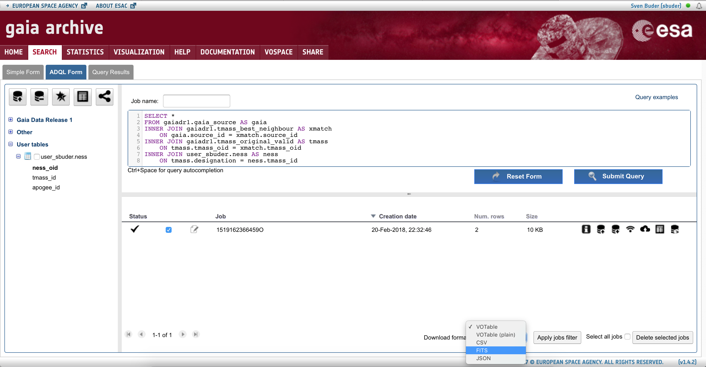

# A simple ADQL to match entries of a file on your computer

You are working in a survey (e.g. APOGEE or GALAH) and want to x-match some of your targets with Gaia DR1 and soon DR2 without downloading terra-bytes of data? Here is a simple instruction how to do that:

## 0) Use the FITS file of the survey or create your own file

Include the 2MASS designation and the target ID of the survey, add a header with the column names, e.g.:

Example file:
```
# tmass_id apogee_id
00000002+7417074 2M00000002+7417074
00000019-1924498 2M00000019-1924498
```

## 1) Use the Gaia archive
Go to the [Gaia archive at ESAC](https://gea.esac.esa.int/archive/)
SIGN IN using the button in the top right corner.
This is important for uploading data and storage limits), my username is ‘sbuder’.
Then go to SEARCH, ADQL FORM

## 2) Uploading tables
Click on the button ‘Upload user table’ above the trees on the left hand side.
Upload your table as ASCII and give it a reasonable name. 
I choose ’ness’ for the following example. 
It should then appear in the bottom of the left tree under User tables:
###### user_sbuder.ness with one column ‘apogee_id'

## 3) ADQL EXAMPLE QUERIES FOR THE GAIA ARCHIVE

### 3.1) Get the complete Gaia DR2 (which will timeout...)

You can try to download everything in Gaia DR2 via
```ruby
SELECT *
FROM gaiadr2.gaia_source AS gaia
```
(good luck with that :D) or only select the columns you really need by specifying your query.

### 3.2) X-match your table with Gaia and 2MASS

If you are Melissa Ness and want to really only selecting the first 10 results of your input apogee_id and the gaia soruce_id that match with Gaia via the 2MASS ID (a x-match of Gaia and 2MASS is already provided by ESAC!):

```ruby
SELECT TOP 10 ness.apogee_id, gaia.source_id
FROM gaiadr2.gaia_source AS gaia
INNER JOIN gaiadr2.tmass_best_neighbour AS xmatch
	ON gaia.source_id = xmatch.source_id
INNER JOIN gaiadr1.tmass_original_valid AS tmass
	ON tmass.tmass_oid = xmatch.tmass_oid
INNER JOIN user_sbuder.ness AS ness
	ON tmass.designation = ness.tmass_id
```

However, the sky is the limit, so you can as easily also just use 'SELECT *’ 
and run that to get all results and all columns of your input file, GAIA and 2MASS. You can also only select everything from certain tables via 'SELECT gaia.*'.

### 3.3) X-match your table 2MASS via the ultimate source_id (from Gaia DR2) but with additional conditions

If you are Eleonora Zari and want to X-match of your table (with gaia.source_id) with 2MASS and only need JHKs magnitudes and their errors for all stars with a good Gaia-2MASS match (angular distance < 1 arcsec) and good 2MASS photometry (ph_qual flag == 'AAA'), you can do the following:

```ruby
SELECT tmass.tmass_oid, tmass.j_m, tmass.h_m, tmass.ks_m, tmass.j_msigcom, tmass.h_msigcom, tmass.ks_msigcom 
FROM user_ezari.table1 AS gaia
INNER JOIN gaiadr2.tmass_best_neighbour AS xmatch
	ON gaia.source_id = xmatch.source_id
INNER JOIN gaiadr1.tmass_original_valid AS tmass
	ON tmass.tmass_oid = xmatch.tmass_oid
WHERE tmass.ph_qual = 'AAA' AND xmatch.angular_distance <= 1.
```

### 3.4) X-match GALAH DR2 with Gaia and also add columns for 2MASS and WISE (if available)

The great thing about GALAH is, that we observe stars which are in 2MASS. So you can first match GALAH and 2MASS and then use the x-match of Gaia and 2MASS provided by the DPAC - thank you guys!. Additionally you can also x-match with the geometric Bayesian distance estimates from [Bailer-Jones et al. (2018)](http://adsabs.harvard.edu/abs/2018arXiv180410121B) - thanks Coryn!.

```ruby
SELECT galahdr2.*, gaia.*, bailerjones18.*, tmass.tmass_oid, tmass.j_m, tmass.j_msigcom,  tmass.h_m, tmass.h_msigcom,  tmass.ks_m, tmass.ks_msigcom, tmass.ph_qual as ph_qual_tmass, tmassxmatch.angular_distance as angular_distance_tmass, allwise.w1mpro, allwise.w1mpro_error, allwise.w2mpro, allwise.w2mpro_error, allwise.w3mpro, allwise.w3mpro_error, allwise.w4mpro, allwise.w4mpro_error, allwise.cc_flags, allwise.ext_flag, allwise.var_flag, allwise.ph_qual as ph_qual_wise, allwisexmatch.angular_distance as angular_distance_wise
FROM 
    gaiadr2.gaia_source as gaia
LEFT OUTER JOIN
    external.gaiadr2_geometric_distance as bailerjones18
    ON bailerjones18.source_id = gaia.source_id	
LEFT OUTER JOIN
    gaiadr2.allwise_best_neighbour AS allwisexmatch
    ON gaia.source_id = allwisexmatch.source_id
LEFT OUTER JOIN
    gaiadr1.allwise_original_valid AS allwise
    ON allwisexmatch.allwise_oid = allwise.allwise_oid
LEFT OUTER JOIN
    gaiadr2.tmass_best_neighbour AS tmassxmatch
    ON gaia.source_id = tmassxmatch.source_id
LEFT OUTER JOIN
    gaiadr1.tmass_original_valid AS tmass
    ON tmassxmatch.tmass_oid = tmass.tmass_oid
INNER JOIN
	user_sbuder.galah_dr2p1_ids as galahdr2
	ON galahdr2.star_id = tmass.designation
```

## 4) Working with the data / download
The Job will get a telephone number and will be shown in the bottom of the server
You can also change the name e.g. into 'APOGEE_GAIA X-match’ in case you plan to submit more jobs. 
Once it is finished (indicated by an arrow on the left), you can either just continue within the server to show data.
You can also select this job, change the download format e.g. to FITS and click on the button ‘Download results’ on the right hand side.


